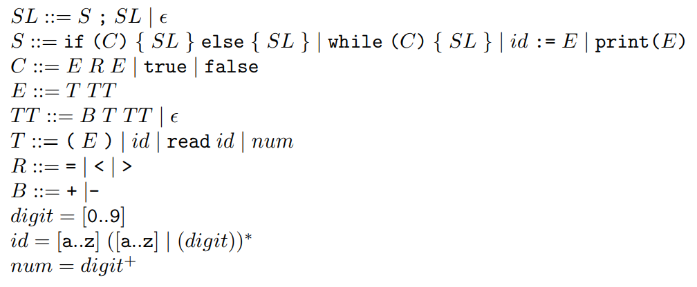

# MiniJava-Scanner-and-Parser
 This project was an assignment for class where we had to implement a simple scanner and parser.
 I wrote the code in src/main/java/Parse.java. The program recognizes the MiniJava Language by scanning and parsing the test cases. MiniJava is defined by the conditional grammar below.
 
